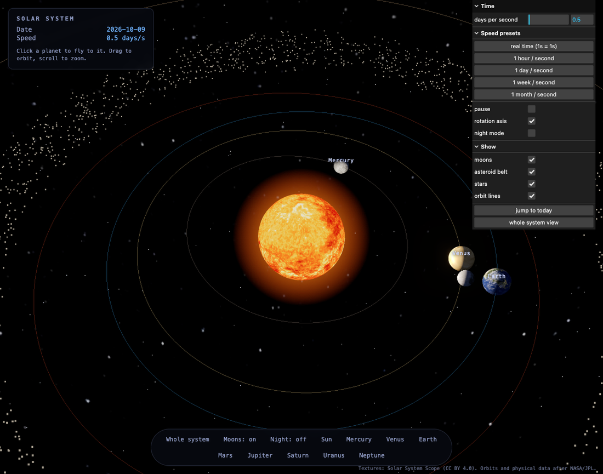
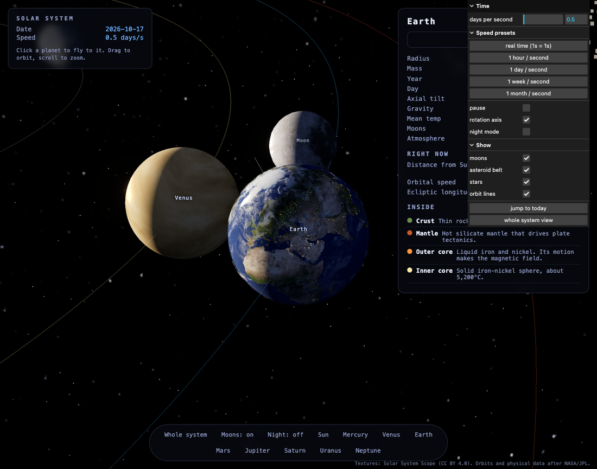
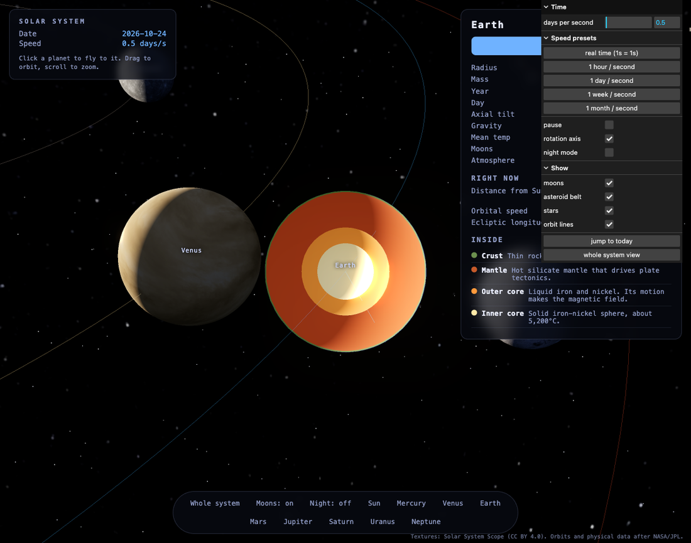

# Solar system

An interactive, realistic simulation of the solar system. The eight planets
orbit the Sun on their real orbital paths, spin at their real rates, and are
tilted at their real axial tilts. Click any planet to fly to it, read a fact
sheet, and look inside with a 3D cutaway.

## Screenshots

The system, with the Sun, orbit lines, and the asteroid belt:



Earth, with its Moon, clouds, and night-side city lights:



Look inside: a clipped 3D cross-section of Earth's interior layers:



## Run it

```sh
bun install
bun run fetch-textures
bun run dev
```

`fetch-textures` downloads the planetary maps once into `public/textures`
(they are not committed). `bun run dev` opens the app at
http://localhost:5174. `bun test` runs the orbital mechanics tests.

## What it does

- **Real, date-accurate orbits**: each planet uses the JPL approximate-elements
  model (Standish), with the rates of change of all six elements per century.
  That is what keeps positions correct for the current date, not just at the
  year 2000 epoch. Accuracy is a few arcminutes over 1800 to 2050.
- **Live position and speed**: select a planet and the panel shows its current
  distance from the Sun, its current orbital speed in km/s, and its heliocentric
  longitude, all recomputed as the clock advances.
- **Real spin and tilt**: true rotation periods (Venus and Uranus retrograde)
  and true axial tilts, which is what drives the seasons. A rotation-axis line
  can be shown for the focused body.
- **Real textures**: photographic planetary maps, credited below.
- **Click to explore**: click a planet in the view, or use the selector bar.
  The camera flies to it and follows it, and the panel shows mass, radius, day,
  year, gravity, temperature, atmosphere, and moons.
- **Look inside**: the "Look inside" button slices the planet open with a
  clipping plane and reveals its interior layers, labelled and to scale, each
  with real depth and composition. Try Earth and Jupiter.
- **Moons and the asteroid belt**: Earth's Moon (textured) follows its real
  eccentric, inclined orbit, so it speeds up near perigee and slows at apogee.
  The four Galilean moons orbit Jupiter, Titan orbits Saturn, and Triton orbits
  Neptune, each on its real period. A field of asteroids fills the belt between
  Mars and Jupiter. A **Moons** button and Show toggles turn any of this on or
  off, and moon names appear when you focus their planet.
- **Time controls with real time**: speed up, pause, or jump to today. Speed
  presets include **real time** (one second is one second), one hour, one day,
  one week, and one month per second. The HUD shows the simulated date. A Whole
  system button frames all eight orbits.

## Scale

The default is a **compressed** scale: distances use a square-root compression
and planet sizes are exaggerated so the whole system is explorable. Real space
is mostly emptiness; at true scale the planets would be invisible specks. A
true-scale toggle is planned.

## Physics

`src/physics/orbital.ts` implements the JPL approximate-elements model: it
advances each element from its J2000 value using its per-century rate, solves
Kepler's equation, and returns the heliocentric ecliptic position and velocity.
`src/physics/planets.ts` holds the element tables and physical data. Both are
pure and unit tested in `test/orbital.test.ts`, including Kepler's third law,
Earth's perihelion and aphelion distances, the known heliocentric longitude at
J2000, and the orbital speeds of Earth (about 30 km/s), Mercury, and Neptune.

## Credit

Planetary textures: Solar System Scope, CC BY 4.0,
https://www.solarsystemscope.com/textures/. Orbital elements and physical data
after NASA/JPL planetary fact sheets.
